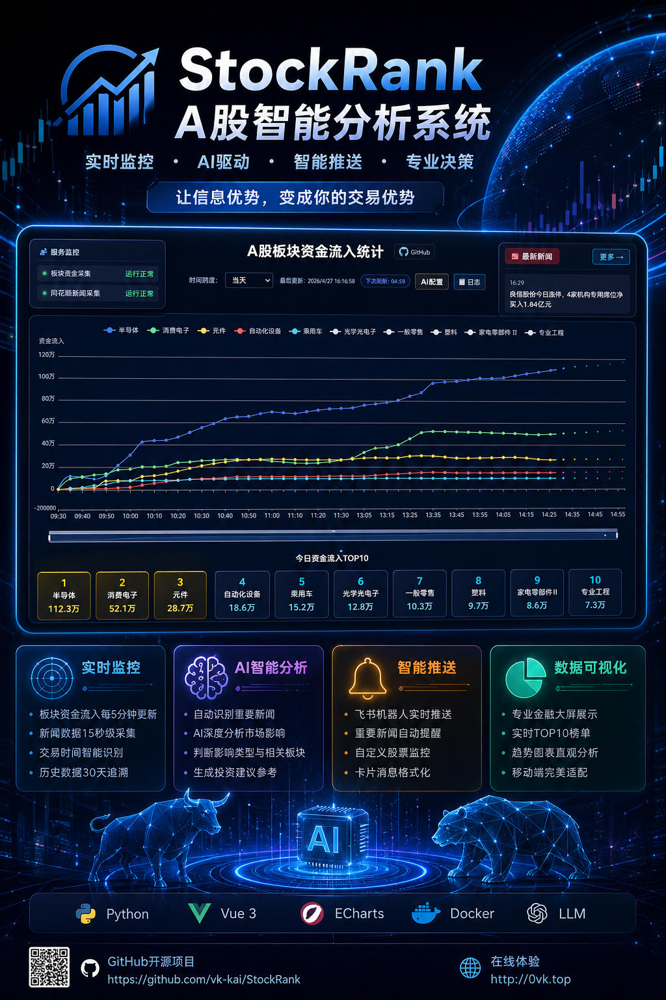

<div align="center">

# 📈 StockRank - A股智能分析系统

**实时监控 · AI驱动 · 智能推送 · 专业决策**

[](LICENSE)
[](https://www.python.org/)
[](https://vuejs.org/)
[](https://www.docker.com/)

[在线演示](http://0vk.top) · [快速开始](#-快速开始) · [功能特性](#-功能特性) · [配置说明](#️-配置说明)

</div>

---



---

## 🎯 项目简介

StockRank 是一个专业的A股市场智能分析系统，通过对接东方财富和同花顺数据源，结合大语言模型（LLM）进行新闻智能分析，为投资者提供全方位的市场监控和决策支持。

### ✨ 核心亮点

| 特性 | 描述 |
|------|------|
| 🔄 **实时监控** | 每5分钟自动更新板块资金流入数据，15秒采集一次新闻 |
| 🤖 **AI智能分析** | 接入GPT等大语言模型，自动分析新闻对A股市场的影响程度和相关板块 |
| 📢 **智能推送** | 支持飞书机器人推送重要新闻，自定义股票关键词监控 |
| 📊 **可视化大屏** | ECharts构建专业金融数据可视化界面，支持移动端适配 |
| 🏠 **西安房价K线** | 集成西安二手房价格K线分析，数据来源国家统计局 |
| 🔐 **安全可靠** | 支持HTTPS、配置密码保护、完善的日志系统 |
| 🐳 **一键部署** | Docker Compose一键部署，开箱即用 |

---

## 🚀 功能特性

### 1. 实时数据采集

- ✅ 板块资金流入数据（每5分钟更新）
- ✅ 同花顺实时新闻（每15秒采集）
- ✅ 历史数据追溯（支持30天）
- ✅ 交易时间智能识别

### 2. AI智能分析

- ✅ 自动识别重要新闻（importance=3）
- ✅ AI深度分析新闻影响
- ✅ 判断影响类型（即时/延迟）
- ✅ 识别相关板块和市场
- ✅ 生成投资建议
- ✅ 智能重试与速率限制处理

### 3. 智能推送系统

- ✅ 飞书机器人实时推送
- ✅ 重要新闻自动推送
- ✅ 自定义股票监控推送
- ✅ 每日汇总定时推送（区分上午/下午）
- ✅ 卡片消息格式化

### 4. 可视化展示

- ✅ 板块资金流向趋势图
- ✅ 实时TOP10榜单
- ✅ 重要新闻滚动展示
- ✅ 西安房价K线分析（月K/季K）
- ✅ 金融风格界面设计
- ✅ 移动端完美适配

### 5. 系统监控

- ✅ 服务状态实时监控
- ✅ 心跳检测与自动恢复
- ✅ 完善的日志系统
- ✅ 日志搜索与过滤

---

## 🎬 快速开始

### 前置要求

- Docker & Docker Compose
- Node.js 18+（仅本地开发需要）

### 一键部署

#### 1. 克隆项目

```bash
git clone https://github.com/vk-kai/StockRank.git
cd StockRank
```

#### 2. 构建前端

```bash
cd frontend
npm install
npm run build
cd ..
```

#### 3. 启动服务

```bash
cd docker
chmod +x install.sh
./install.sh
```

或手动启动：

```bash
cd docker
docker compose up -d --build
```

#### 4. 访问系统

打开浏览器访问：`http://服务器IP`

### 服务管理

```bash
# 查看服务状态
docker compose ps

# 查看日志
docker compose logs -f

# 停止服务
docker compose down

# 重启服务
docker compose restart
```

---

## ⚙️ 配置说明

首次访问系统后，点击右上角 **🤖 AI配置** 进入配置页面。

### AI大模型配置

支持所有兼容 OpenAI API 格式的模型：

| 配置项 | 说明 |
|--------|------|
| API地址 | OpenAI官方或国内镜像地址 |
| API密钥 | 您的API Key |
| 模型名称 | gpt-3.5-turbo, gpt-4 等 |
| 温度参数 | 0-1，建议0.7 |
| 最大Token | 建议1000-2000 |
| 超时时间 | 建议60-120秒 |
| 重试次数 | 失败后重试次数 |

### 飞书机器人配置

1. 打开飞书群设置 → 群机器人 → 添加机器人 → 自定义机器人
2. 复制 Webhook 地址和签名密钥
3. 在配置页面填入相关信息

### 股票监控配置

添加您关注的股票，设置关键词，当新闻匹配关键词时自动推送：

```json
{
  "name": "同花顺",
  "code": "300338",
  "keywords": ["同花顺", "300338", "花顺"]
}
```

---

## 🏗️ 技术架构

### 技术栈

| 层级 | 技术 |
|------|------|
| 前端 | Vue 3 + Vue Router + ECharts |
| 后端 | Python 3.11 + Flask |
| 数据源 | 东方财富 + 同花顺 |
| AI服务 | OpenAI API 兼容接口 |
| 推送服务 | 飞书机器人 Webhook |
| 容器化 | Docker + Nginx |

### 项目结构

```
StockRank/
├── backend/              # 后端代码
│   ├── app.py           # Flask应用入口
│   ├── data_collector.py # 板块数据采集
│   ├── news_collector.py # 新闻采集与AI分析
│   ├── ai_analyzer.py   # AI分析模块
│   ├── feishu_pusher.py # 飞书推送
│   └── monitor.py       # 服务监控
├── frontend/            # 前端代码
│   └── src/
│       ├── App.vue      # 首页
│       ├── NewsPage.vue # 新闻页
│       ├── ConfigPage.vue # 配置页
│       ├── LogPage.vue  # 日志页
│       └── HouseKline.vue # 房价K线页
├── config/              # 配置文件
├── data/                # 数据目录
├── logs/                # 日志目录
└── docker/              # Docker配置
    ├── docker-compose.yml
    ├── backend.Dockerfile
    └── nginx.conf
```

---

## ❓ 常见问题

### Q: 如何获取 OpenAI API 密钥？

A: 访问 [OpenAI官网](https://platform.openai.com/) 注册账号，在 API Keys 页面创建密钥。也可以使用国内镜像站。

### Q: 支持哪些 AI 模型？

A: 支持所有兼容 OpenAI API 格式的模型：
- OpenAI: GPT-3.5, GPT-4
- 国内镜像: 各种 GPT 镜像站
- 其他: 任何兼容 OpenAI API 的服务

### Q: 数据采集频率可以修改吗？

A: 可以。修改后端代码中的相关参数：
- `DATA_COLLECTION_INTERVAL`: 板块数据采集间隔（默认5分钟）
- `NEWS_COLLECTION_INTERVAL`: 新闻采集间隔（默认15秒）

### Q: 如何配置 HTTPS？

A: 使用 Certbot 自动配置 SSL 证书：

```bash
# 安装 certbot
sudo apt install certbot

# 申请证书
sudo certbot certonly --webroot -w /var/www/certbot -d your-domain.com

# 证书自动续期
sudo crontab -e
# 添加: 0 3 * * * certbot renew --quiet
```

---

## 📞 联系方式

- 项目主页: [https://github.com/vk-kai/StockRank](https://github.com/vk-kai/StockRank)
- 问题反馈: [Issues](https://github.com/vk-kai/StockRank/issues)
- 邮箱: 2563105014@qq.com

---

## 🙏 致谢

感谢以下开源项目：

- [Vue.js](https://vuejs.org/)
- [Flask](https://flask.palletsprojects.com/)
- [ECharts](https://echarts.apache.org/)
- [OpenAI](https://openai.com/)

---

<div align="center">

**⭐ 如果这个项目对您有帮助，请给一个 Star 支持一下！⭐**

Made with ❤️ by vk-kai

</div>
