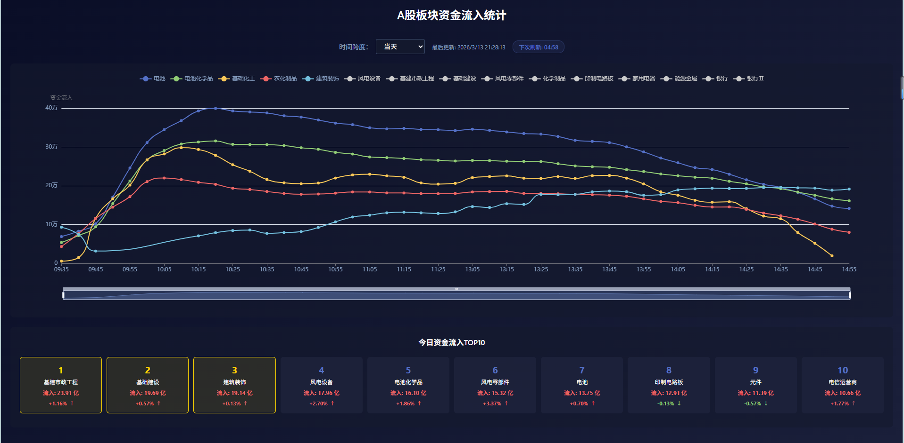

# 📈 A股板块资金流入统计系统

**实时监控A股市场板块资金流向 · 智能数据分析 · 可视化大屏展示**

[功能特性](#功能特性) · [快速开始](#快速开始) · [部署指南](#部署指南) · [技术架构](#技术架构)

## 🎨 界面预览

<div align="center">



</div>

***

## 🎯 项目简介

这是一个专业的A股市场板块资金流入实时监控系统，通过对接东方财富数据源，实时采集和分析各板块的资金流向数据，为投资者提供直观、准确的市场资金动态分析。

### ✨ 核心亮点

- 🔄 **实时数据采集** - 每5分钟自动更新板块资金流入数据
- 📊 **智能数据分析** - 自动计算每日资金流入TOP榜单
- 📈 **可视化展示** - 使用ECharts构建交互式数据大屏
- 🗄️ **历史数据追溯** - 支持查询最近30天的历史数据
- 🐳 **容器化部署** - 完整的Docker部署方案，一键启动
- 🚀 **高性能架构** - 前后端分离，支持高并发访问

***

## 🚀 功能特性

### 数据采集

- ✅ 实时获取A股所有板块资金流入数据
- ✅ 自动计算板块涨跌幅
- ✅ 5分钟间隔自动数据更新
- ✅ 异常自动重试机制

### 数据分析

- ✅ 每日资金流入TOP10榜单
- ✅ 板块资金流向趋势分析
- ✅ 历史数据对比
- ✅ 实时分钟级数据追踪

### 可视化展示

- ✅ 交互式折线图展示资金流向
- ✅ 板块排名卡片展示
- ✅ 涨跌幅颜色标识
- ✅ 自动倒计时刷新
- ✅ 响应式布局设计

### 系统功能

- ✅ RESTful API接口
- ✅ 完整的日志记录
- ✅ 健康检查接口
- ✅ 跨域支持
- ✅ Nginx反向代理

***

## 📁 项目结构

```
StockRank/
├── backend/                 # 后端服务
│   ├── app.py              # Flask应用主程序
│   ├── config.py           # 配置文件
│   ├── data_collector.py   # 数据采集模块
│   ├── data_processor.py   # 数据处理模块
│   ├── logger.py           # 日志模块
│   ├── requirements.txt    # Python依赖
│   └── start.sh            # 启动脚本
├── frontend/               # 前端服务
│   ├── src/
│   │   ├── App.vue         # 主组件
│   │   ├── main.js         # 入口文件
│   │   ├── services/       # API服务
│   │   ├── styles/         # 样式文件
│   │   └── utils/          # 工具函数
│   ├── dist/               # 构建输出
│   └── package.json       # Node依赖
├── docker/                 # Docker配置
│   ├── backend.Dockerfile  # 后端镜像
│   ├── frontend.Dockerfile # 前端镜像
│   ├── docker-compose.yml  # 编排配置
│   └── nginx.conf          # Nginx配置
├── data/                   # 数据存储
│   ├── daily/              # 每日数据
│   └── realtime/           # 实时数据
├── logs/                   # 日志文件
└── README.md               # 项目文档
```

***

## 🛠 技术架构

### 后端技术栈

- **Flask 3.0** - 轻量级Web框架
- **Flask-CORS** - 跨域支持
- **Requests** - HTTP请求库
- **Gunicorn** - WSGI服务器
- **Threading** - 多线程数据采集

### 前端技术栈

- **Vue.js 3.4** - 渐进式JavaScript框架
- **Vite 5.0** - 现代化构建工具
- **ECharts 5.4** - 数据可视化库
- **Vue-ECharts** - Vue ECharts组件
- **Axios** - HTTP客户端

### 部署技术栈

- **Docker** - 容器化部署
- **Docker Compose** - 多容器编排
- **Nginx** - 反向代理和静态文件服务

***


### 主要功能模块

#### 1. 实时资金流向大屏

- 动态折线图展示各板块资金流入趋势
- 支持多时间维度切换（当天/7天/15天/30天）
- 自动5分钟倒计时刷新

#### 2. 板块排名榜单

- TOP10板块资金流入排名
- 实时涨跌幅显示
- 颜色标识（红色上涨/绿色下跌）
- 鼠标悬停高亮图表对应数据

#### 3. 历史数据查询

- 支持查询最近30天历史数据
- 数据对比分析
- 趋势追踪

***

## 🚀 快速开始

### 环境要求

- Python 3.11+
- Node.js 16+
- Docker & Docker Compose（可选）

### 方式一：Docker部署（推荐）

```bash
# 1. 克隆项目
git clone <repository-url>
cd StockRank

# 2. 启动服务
cd docker
docker-compose up -d

# 3. 访问应用
# 浏览器打开: http://localhost
```

### 方式二：本地开发

#### 后端启动

```bash
# 1. 进入后端目录
cd backend

# 2. 安装依赖
pip install -r requirements.txt

# 3. 启动服务
python app.py
```

#### 前端启动

```bash
# 1. 进入前端目录
cd frontend

# 2. 安装依赖
npm install

# 3. 开发模式启动
npm run dev

# 4. 构建生产版本
npm run build
```

***

## 📡 API接口

### 获取当前资金流向

```
GET /api/flow/current
```

**响应示例：**

```json
{
  "success": true,
  "data": [
    {
      "name": "银行",
      "flow": 123456.78,
      "change": 0.0234
    }
  ],
  "timestamp": "2026-03-13T10:30:00+08:00"
}
```

### 获取历史数据

```
GET /api/flow/history?days=7
```

**参数：**

- `days`: 查询天数（1-30）

### 获取分钟级数据

```
GET /api/flow/minute?hours=24
```

**参数：**

- `hours`: 查询小时数（1-24）

### 健康检查

```
GET /health
```

***

## 🐳 部署指南

### Docker部署

#### 构建镜像

```bash
# 构建后端镜像
docker build -f docker/backend.Dockerfile -t a-stock-backend .

# 构建前端镜像
docker build -f docker/frontend.Dockerfile -t a-stock-frontend .
```

#### 使用Docker Compose

```bash
# 启动所有服务
docker-compose up -d

# 查看日志
docker-compose logs -f

# 停止服务
docker-compose down

# 重启服务
docker-compose restart
```

### Nginx配置

系统已配置Nginx反向代理，默认配置：

- 前端静态文件：`/usr/share/nginx/html`
- 后端API代理：`/api/*` → `http://backend:5000`

***

## 📊 数据说明

### 数据来源

- **东方财富网** - 板块资金流入数据
- **更新频率** - 每5分钟自动更新

### 数据字段

- `name` - 板块名称
- `flow` - 资金净流入（万元）
- `change` - 涨跌幅（小数）
- `rank` - 排名

### 数据存储

- **每日数据** - `data/daily/YYYY-MM-DD.json`
- **实时数据** - `data/realtime/YYYY-MM-DD.json`
- **数据保留** - 最近30天

***

## 🔧 配置说明

### 后端配置（backend/config.py）

```python
# 数据目录
DATA_DIR = os.path.join(BASE_DIR, 'data')
DAILY_DIR = os.path.join(DATA_DIR, 'daily')
REALTIME_DIR = os.path.join(DATA_DIR, 'realtime')
LOG_DIR = os.path.join(BASE_DIR, 'logs')

# 最大保留天数
MAX_DAYS = 30

# 数据源URL
DATA_URL = "https://push2.eastmoney.com/api/qt/clist/get"
```

### 前端配置（frontend/src/services/apiService.js）

```javascript
const API_BASE_URL = import.meta.env.VITE_API_URL || 'http://localhost:5000'
```

***

## 📝 日志系统

系统提供三种日志类型：

- **系统日志** (`logs/system.log`) - 系统运行状态
- **数据日志** (`logs/data.log`) - 数据采集记录
- **错误日志** (`logs/error.log`) - 异常错误信息

***

## 🤝 贡献指南

欢迎提交Issue和Pull Request！

1. Fork本仓库
2. 创建特性分支 (`git checkout -b feature/AmazingFeature`)
3. 提交更改 (`git commit -m 'Add some AmazingFeature'`)
4. 推送到分支 (`git push origin feature/AmazingFeature`)
5. 开启Pull Request

***

## 📄 许可证

本项目采用 MIT 许可证 - 查看 [LICENSE](LICENSE) 文件了解详情

***

## 📞 联系方式

如有问题或建议，欢迎通过以下方式联系：

- 提交Issue
- 发送邮件

***

## 🙏 致谢

- 数据来源：[东方财富网](https://www.eastmoney.com/)
- 前端框架：[Vue.js](https://vuejs.org/)
- 可视化库：[ECharts](https://echarts.apache.org/)

***

<div align="center">

**⭐ 如果这个项目对你有帮助，请给个Star支持一下！⭐**

Made with ❤️ by StockRank Team

</div>
